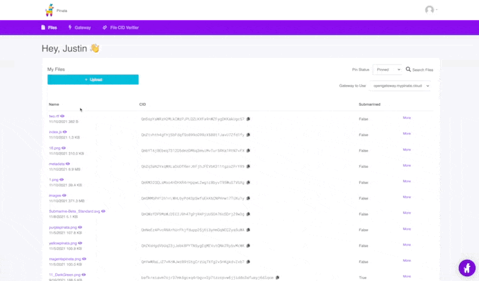
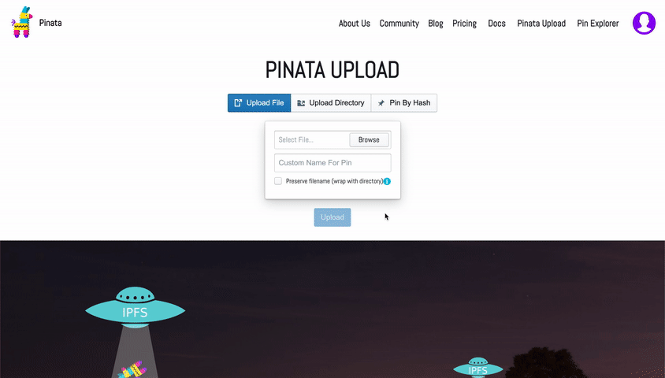
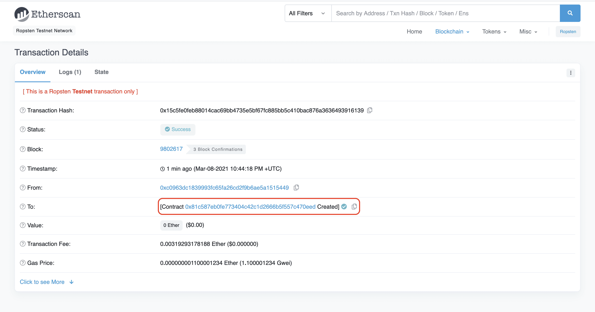
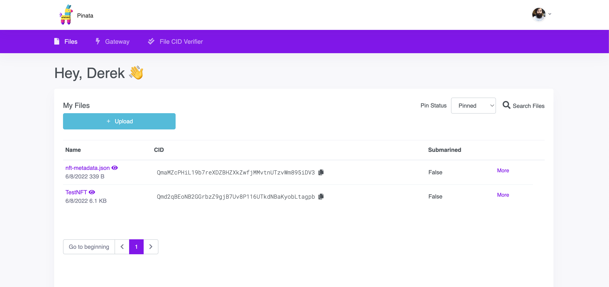
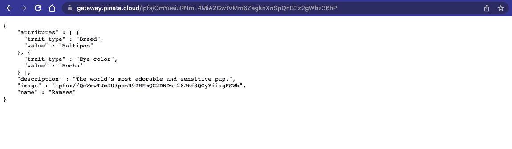
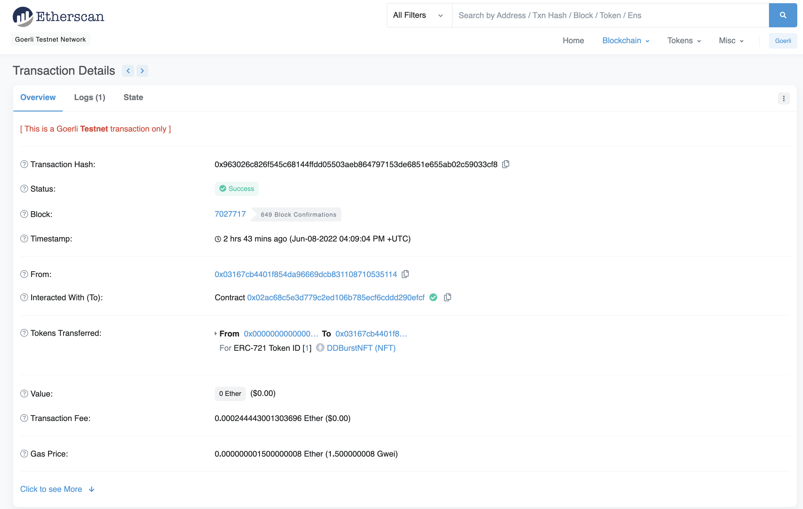

# **Dev Degree Burst 2022**: Crypto for Skeptics Workshop

> **_This workshop was adapted from an official guide by [Etherium.org](https://ethereum.org/en/developers/tutorials/how-to-write-and-deploy-an-nft/)_**

# **Part 2**: How to Mint an NFT

[Beeple](https://www.nytimes.com/2021/03/11/arts/design/nft-auction-christies-beeple.html): $69 Million [3LAU](https://www.forbes.com/sites/abrambrown/2021/03/03/3lau-nft-nonfungible-tokens-justin-blau/?sh=5f72ef64643b): $11 Million [Grimes](https://www.theguardian.com/music/2021/mar/02/grimes-sells-digital-art-collection-non-fungible-tokens): $6 Million

All of them minted their NFT’s using Alchemy’s powerful API. In this tutorial, we’ll teach you how to do the same in <10 minutes.

“Minting an NFT” is the act of publishing a unique instance of your ERC-721 token on the blockchain. Using our smart contract from `Part 1` of this NFT tutorial series, let’s flex our Web3 skills and mint an NFT. At the end of this tutorial, you’ll be able to mint as many NFTs as your heart (and wallet) desires!

Let’s get started!

## STEP 1: INSTALL WEB3

If you followed the first tutorial on creating your NFT smart contract, you already have experience using Ethers.js. Web3 is similar to Ethers, as it is a library used to make creating requests to the Ethereum blockchain easier. In this tutorial we’ll be using [Alchemy Web3](https://docs.alchemyapi.io/alchemy/documentation/alchemy-web3), which is an enhanced Web3 library that offers automatic retries and robust WebSocket support.

In your project home directory run:

```
npm install @alch/alchemy-web3
```

## STEP 2: CREATE A MINT-NFT.JS FILE

Inside your scripts directory, create a `mint-nft.js` file and add the following lines of code:

```js
require('dotenv').config();
const API_URL = process.env.API_URL;
const { createAlchemyWeb3 } = require('@alch/alchemy-web3');
const web3 = createAlchemyWeb3(API_URL);
```

## STEP 3: GRAB YOUR CONTRACT ABI

Our contract ABI (Application Binary Interface) is the interface to interact with our smart contract. You can learn more about [Contract ABIs](https://docs.alchemyapi.io/alchemy/guides/eth_getlogs#what-are-ab-is) here. Hardhat automatically generates an ABI for us and saves it in the `MyNFT.json` file. In order to use this we’ll need to parse out the contents by adding the following line of code to the end of our `mint-nft.js` file:

```js
const contract = require('../artifacts/contracts/MyNFT.sol/MyNFT.json');
```

If you want to see the ABI you can print it to your console by adding this line to `mint-nft.js`:

```js
console.log(JSON.stringify(contract.abi));
```

To run `mint-nft.js` and see your ABI printed to the console navigate to your terminal and run:

```
node scripts/mint-nft.js
```

## STEP 4: CONFIGURE THE METADATA FOR YOUR NFT USING IPFS

If you remember from our tutorial in `Part 1`, our `mintNFT` smart contract function takes in a tokenURI parameter that should resolve to a JSON document describing the NFT's metadata— which is really what brings the NFT to life, allowing it to have configurable properties, such as a name, description, image, and other attributes.

> _Interplanetary File System (IPFS) is a decentralized protocol and peer-to-peer network for storing and sharing data in a distributed file system._

We will use [Pinata](https://app.pinata.cloud/), a convenient IPFS API and toolkit, to store our NFT asset and metadata to ensure our NFT is truly decentralized. If you don’t have a Pinata account, [sign up for a free account here](https://app.pinata.cloud/) and complete the steps to verify your email.

Once you’ve created an account:

- Navigate to the `“Files”` page and click the blue `"Upload"` button at the top-left of the page.

- Upload an image to Pinata — this will be the image asset for your NFT. Feel free to name the asset whatever you wish

- After you upload, you'll see the file info in the table on the "Files" page. You'll also see a CID column. You can copy the CID by clicking the copy button next to it. You can view your upload at: https://gateway.pinata.cloud/ipfs/<CID>. You can find the image we used on IPFS [here](https://gateway.pinata.cloud/ipfs/QmarPqdEuzh5RsWpyH2hZ3qSXBCzC5RyK3ZHnFkAsk7u2f), for example.

For the more visual learners, the steps above are summarized here:



Now, we’re going to want to upload one more document to Pinata. But before we do that, we need to create it!

In your root directory, make a new file called `nft-metadata.json` and add the following json code:

```json
{
  "attributes": [
    {
      "trait_type": "Breed",
      "value": "Maltipoo"
    },
    {
      "trait_type": "Eye color",
      "value": "Mocha"
    }
  ],
  "description": "The world's most adorable and sensitive pup.",
  "image": "ipfs://QmWmvTJmJU3pozR9ZHFmQC2DNDwi2XJtf3QGyYiiagFSWb",
  "name": "Ramses"
}
```

Feel free to change the data in the json. You can remove or add to the attributes section. Most importantly, make sure image field points to the location of your IPFS image — otherwise, your NFT will include a photo of a (very cute!) dog.

Once you’re done editing the JSON file, save it and upload it to Pinata, following the same steps we did for uploading the image.



## STEP 5: CREATE AN INSTANCE OF YOUR CONTRACT

Now, to interact with our contract, we need to create an instance of it in our code. To do so we’ll need our contract address which we can get from the deployment or [Etherscan](https://rinkeby.etherscan.io/) by looking up the address you used to deploy the contract.



In the above example, our contract address is `0x81c587EB0fE773404c42c1d2666b5f557C470eED`.

add this to your `.env` file

```
CONTRACT_ADDRESS="your-contract-address"
```

Next we will use the Web3 contract method to create our contract using the ABI and address. In your `mint-nft.js` file, add the following:

at the top, import the `.env` variable

```js
const CONTRACT_ADDRESS = process.env.CONTRACT_ADDRESS;
```

then below:

```js
const contractAddress = CONTRACT_ADDRESS;

const nftContract = new web3.eth.Contract(contract.abi, contractAddress);
```

## STEP 6: UPDATE THE .ENV FILE

Now, in order to create and send transactions to the Ethereum chain, we’ll use your public ethereum account address to get the account nonce (will explain below).

Add your public key to your .env file — if you completed part 1 of the tutorial, our .env file should now look like this:

```
API_URL = "https://eth-goerli.alchemyapi.io/v2/your-api-key"
PRIVATE_KEY = "your-private-account-address"
CONTRACT_ADDRESS="your-contract-address"
PUBLIC_KEY = "your-metamask-public-account-address ie: (0x...)"
```

## STEP 7: CREATE YOUR TRANSACTION

First, let’s define a function named mintNFT(tokenData) and create our transaction by doing the following:

1. Grab your `PRIVATE_KEY` and `PUBLIC_KEY` from the `.env` file.

2. Next, we’ll need to figure out the account nonce. The nonce specification is used to keep track of the number of transactions sent from your address — which we need for security purposes and to prevent [replay attacks](https://docs.alchemyapi.io/resources/blockchain-glossary#account-nonce). To get the number of transactions sent from your address, we use [getTransactionCount](https://docs.alchemyapi.io/documentation/alchemy-api-reference/json-rpc#eth_gettransactioncount).

3. Finally we’ll set up our transaction with the following info:

- `'from': PUBLIC_KEY` — The origin of our transaction is our public address

- `'to': contractAddress` — The contract we wish to interact with and send the transaction

- `'nonce': nonce` — The account nonce with the number of transactions send from our address

- `'gas': estimatedGas` — The estimated gas needed to complete the transaction

- `'data': nftContract.methods.mintNFT(PUBLIC_KEY, md).encodeABI()` — The computation we wish to perform in this transaction — which in this case is minting a NFT

Your `mint-nft.js` file should look like this now:

```js
   require('dotenv').config();
   const API_URL = process.env.API_URL;
   const CONTRACT_ADDRESS = process.env.CONTRACT_ADDRESS
   const PUBLIC_KEY = process.env.PUBLIC_KEY;
   const PRIVATE_KEY = process.env.PRIVATE_KEY;

   const { createAlchemyWeb3 } = require("@alch/alchemy-web3");
   const web3 = createAlchemyWeb3(API_URL);

   const contract = require("../artifacts/contracts/MyNFT.sol/MyNFT.json");
   const contractAddress = CONTRACT_ADDRESS;
   const nftContract = new web3.eth.Contract(contract.abi, contractAddress);

   async function mintNFT(tokenURI) {
     const nonce = await web3.eth.getTransactionCount(PUBLIC_KEY, 'latest'); //get latest nonce

   //the transaction
     const tx = {
       'from': PUBLIC_KEY,
       'to': contractAddress,
       'nonce': nonce,
       'gas': 500000,
       'data': nftContract.methods.mintNFT(PUBLIC_KEY, tokenURI).encodeABI()
     };
   }​
```

## STEP 8: SIGN THE TRANSACTION

Now that we’ve created our transaction, we need to sign it in order to send it off. Here is where we’ll use our private key.

`web3.eth.sendSignedTransaction` will give us the transaction hash, which we can use to make sure our transaction was mined and didn't get dropped by the network. You'll notice in the transaction signing section, we've added some error checking so we know if our transaction successfully went through.

Add `signPromise` into your `mintNFT()` async function immediately after the transaction code:

```js
  ...

  const signPromise = web3.eth.accounts.signTransaction(tx, PRIVATE_KEY)
  signPromise
    .then((signedTx) => {
      web3.eth.sendSignedTransaction(
        signedTx.rawTransaction,
        function (err, hash) {
          if (!err) {
            console.log(
              "The hash of your transaction is: ",
              hash,
              "\nCheck Alchemy's Mempool to view the status of your transaction!"
            )
          } else {
            console.log(
              "Something went wrong when submitting your transaction:",
              err
            )
          }
        }
      )
    })
    .catch((err) => {
      console.log(" Promise failed:", err)
    })
```

STEP 9: CALL MINTNFT AND RUN NODE MINT-NFT.JS

Remember the `nft-metadata.json` you uploaded to Pinata? Copy its hashcode **(CID)** from Pinata, we'll pass it's value into `mintNFT()` in the next step.

Here’s how to find your `nft-metadata.json` hashcode **(CID)**:



> Double check that the hashcode you copied links to your metadata.json by loading https://gateway.pinata.cloud/ipfs/<metadata-hash-code> into a separate window. The page should look similar to the screenshot below:
> 

Altogether, your `mint-nft.js` code should look something like this:

```js
require('dotenv').config();
const API_URL = process.env.API_URL;
const CONTRACT_ADDRESS = process.env.CONTRACT_ADDRESS;
const PUBLIC_KEY = process.env.PUBLIC_KEY;
const PRIVATE_KEY = process.env.PRIVATE_KEY;

const { createAlchemyWeb3 } = require('@alch/alchemy-web3');
const web3 = createAlchemyWeb3(API_URL);

const contract = require('../artifacts/contracts/MyNFT.sol/MyNFT.json');
const contractAddress = CONTRACT_ADDRESS;
const nftContract = new web3.eth.Contract(contract.abi, contractAddress);

async function mintNFT(tokenURI) {
  const nonce = await web3.eth.getTransactionCount(PUBLIC_KEY, 'latest'); //get latest nonce

  //the transaction
  const tx = {
    from: PUBLIC_KEY,
    to: contractAddress,
    nonce: nonce,
    gas: 500000,
    data: nftContract.methods.mintNFT(PUBLIC_KEY, tokenURI).encodeABI(),
  };

  const signPromise = web3.eth.accounts.signTransaction(tx, PRIVATE_KEY);
  signPromise
    .then((signedTx) => {
      web3.eth.sendSignedTransaction(
        signedTx.rawTransaction,
        function (err, hash) {
          if (!err) {
            console.log(
              'The hash of your transaction is: ',
              hash,
              "\nCheck Alchemy's Mempool to view the status of your transaction!"
            );
          } else {
            console.log(
              'Something went wrong when submitting your transaction:',
              err
            );
          }
        }
      );
    })
    .catch((err) => {
      console.log('Promise failed:', err);
    });
}

mintNFT('ipfs://QmYueiuRNmL4MiA2GwtVMm6ZagknXnSpQnB3z2gWbz36hP'); // <- Your NFT Metadata Hashcode CID
```

Now, run `node scripts/mint-nft.js` to deploy your NFT. After a couple of seconds, you should see a response like this in your terminal:

```
The hash of your transaction is: 0x10e5062309de0cd0be7edc92e8dbab191aa2791111c44274483fa766039e0e00

Check Alchemy's Mempool to view the status of your transaction!
```

Next, visit your [Alchemy mempool](https://dashboard.alchemyapi.io/mempool) to see the status of your transaction (whether it’s pending, mined, or got dropped by the network). If your transaction got dropped, it’s also helpful to check [Rinkeby Etherscan](https://rinkeby.etherscan.io/) and search for your transaction hash.



And that’s it! You’ve now deployed AND minted with a NFT on the Ethereum blockchain 🤑

Using the `mint-nft.js` you can mint as many NFT's as your heart (and wallet) desires! Just be sure to pass in a new tokenURI describing the NFT's metadata (otherwise, you'll just end up making a bunch of identical ones with different IDs).

Presumably, you’d like to be able to show off your NFT in your wallet — so be sure to check out **Part 3: How to View Your NFT in Your Wallet!**
