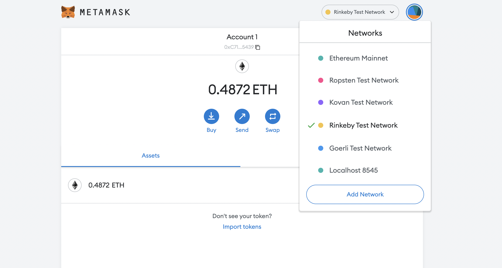
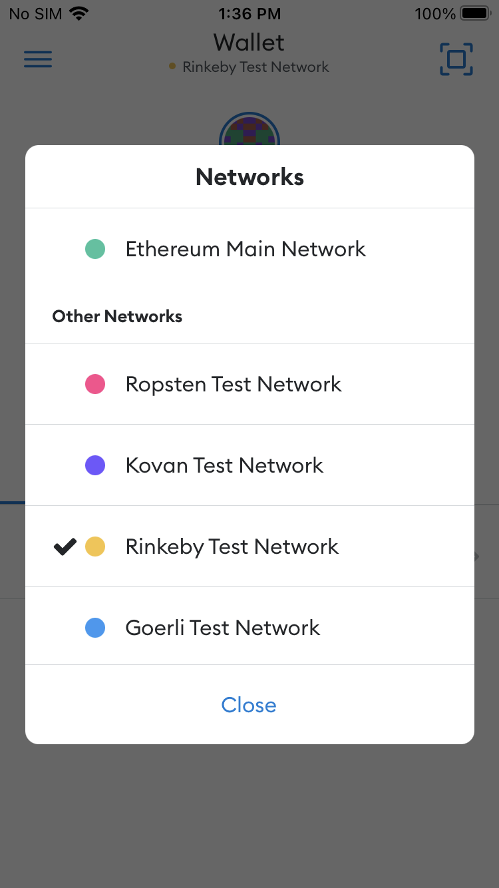

# **Dev Degree Burst 2022**: Crypto for Skeptics Workshop

> **_This workshop was adapted from an official guide by [Etherium.org](https://ethereum.org/en/developers/tutorials/how-to-write-and-deploy-an-nft/)_**

# **Part 3**: View your NFT in your Wallet

This tutorial is Part 3 in the NFT Tutorial series, where we view our newly minted NFT. However, you can use the general tutorial for any ERC-721 token using MetaMask, including on Mainnet or any testnet.

Congrats! You’ve made it to the shortest and simplest part of our NFT tutorial series — how to view your freshly minted NFT on a virtual wallet. We’ll be using MetaMask for this example since it is what we used in the previous two parts.

As a prerequisite, you should already have MetaMask on mobile installed, and it should include the account to which you minted your NFT — you can get the app for free on [iOS](https://apps.apple.com/us/app/metamask-blockchain-wallet/id1438144202) or [Android](https://play.google.com/store/apps/details?id=io.metamask&hl=en_US&gl=US).

_It's important to note, that you can only view NFTs on the **mobile version** of MetaMask, not the desktop, or browser extension._

## STEP 1: SET YOUR NETWORK TO RINKEBY

1. In the Web extension, select Rinkeby Test Network from the drop down

2. From the Network Settings choose the Advanced Options tab

3. Ensure "Show Test Servers" is enabled

4. Once you have authenticated into the mobile app using your 12-word Secret Recovery Phrase, select the `Rinkeby Test Network` at the top.

## STEP 2: ADD YOUR COLLECTABLE TO METAMASK

Once you’re on the Rinkeby network, select the "NFTs" tab on the right and add the NFT `smart contract address` and the ERC-721 `token ID` of your NFT — which you should be able to find on Etherscan based on the transaction hash from your NFT deployed in Part II of our tutorial.

You may need to refresh a couple times to view your NFT — but it will be there 😄!

Congrats! You have successfully minted an NFT, and you can now view it! We can’t wait to see how you’ll take the NFT world by storm!

## View your NFT on OpenSea

**OpenSea** is an online NFT marketplace, that handles traiding, buying and selling. We can use to view our NFT there as well as it is connected to the blockchain.

Go to [OpenSea testnet](https://testnets.opensea.io/), and search using your Wallet id, or the Contract Address
